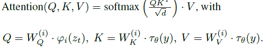
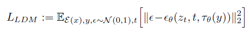

# Latent Diffusion

*Robin Rombach, Andreas Blattmann, Dominik Lorenz, Patrick Esser, Bjorn Ommer, High-Resolution Image Synthesis with Latent Diffusion Models*

#### Introduction

* Latent Diffusion Models are primarily layers of denoising Autoencoders stacked on top of one another
* That is we start with noise and denoise the image gradually obtaining an image with higher quality
* They are likelihood based models implying that they cover the smallest of probabilities which make the training more stable.
* But this very property also implies that they are computationally more expensive to train or generate images
* The authors chose an approach that would not directly model probabilities of pixels but transform it into latent space - a lower dimensional space that essentially contains the same information as the pixels
* That is, a compression problem. Here are two forms of compression:
    1. Perceptual Compression - Removes high frequency information like noise and does not learn much semantic variation
    2. Semantic Compression - This learns and models semantic variation and this leads to compression in terms of domain knowledge.
* Latent Diffusion Models first employ the perceptual compression to a lower dimensional space (the latent space), then the semantic compression learns the data distribution more efficiently. 
* The reduced complexity provides efficient image generation from the latent space with a single network pass. Hence called the latent diffusion model.

#### Previous Approaches

* Previous two-stage approaches often relied on autoregressive, attention-based transformer models to model the distribution in latent space. These models, when applied to learned spaces, typically ignore much of the inherent 2D structure and rely on an arbitrary 1D ordering, requiring highly compressed, discrete latent spaces for feasible training (to limit computational cost). However, such aggressive compression can limit the overall performance and fidelity of reconstructions
* The ability to efficiently operate in higher-dimensional latent spaces means LDMs do not need the heavy spatial downsampling required by related generative models in latent space. This allows LDMs to achieve a better balance between complexity reduction (by being in latent space) and detail preservation (by not needing aggressive compression), avoiding the trade-offs faced by methods that need high compression for computational feasibility. As a result, LDMs can provide more faithful and detailed reconstructions than previous work operating at higher compression levels.

#### Perceptual Image Compression

* Using traditional loss functions (L1 / L2) with auto encoders might lead to blurry images. Hence we consider the following losses.
  
Perceptual Loss:

* Instead of comparing original x and generated x̃ directly in pixel space using, for example, an L1 or L2 loss, this loss compares their representations in the feature space of another network (e.g., a network like VGG)
* loss(L) = ‖Φ(x) - Φ(D(E(x)))‖^p 
  => Φ is the other network in whose space we are comparing the embeddings
  => D and E and decoder and encoder of the autoencoder respectively
  => p is the Lp norm co-efficient

Patch Based Adversarial Objective:

* Adversarial models try to fool a discriminator on if the images are synthetically generated or real.
* Here the adversarial objective is to make sure a discriminator does not know the difference between the generated image and the real image at the scale of different patches making the reconstructions more realistic.
* The discriminator Dψ maximizes its ability to classify real (Dψ(x)) images (logDψ(x)) and fake images D(E(x)) can be related to -log(1 - Dψ(D(E(x))))
 => Dψ is the discriminator which operates on patches
 => D and E and decoder and encoder of the autoencoder respectively

KL-reg. in LDMs encourages the encoder to learn a latent space whose distribution is somewhat close to a standard normal, acting as a mild constraint to make the space more structured and easier for the Diffusion Model to model, while using a low weight to preserve the autoencoder's ability to reconstruct details

#### Latent Diffusion Models

* Loss(DM) := E [z,ε∼N (0,1),t [‖ε−εθ(zt, t)‖^2]]
  => z is the true signal
  => ε is the noise sampled from the normal distribution N(0,1)
  => εθ is the neural network that noises the true signal
  => zt is the noise added signal at time step t
* In essence, the objective function L(DM) represents the mean squared error between the ground truth noise ε and the noise predicted by the network εθ(zt, t), averaged over different data samples, noise instances, and time steps. By minimizing this objective, the diffusion model learns to accurately estimate the noise component at each step t of the reverse process
* Though our objective is what it is, we are not inverting our weights to do this! We are using the UNet backbone neural network with the above defined loss functions for denoising which essentially does the same thing mathematically!

#### Conditioning Mechanisms

* To make these models capable of generating images based on external inputs (like text, semantic maps, etc.), they need to model conditional distributions p(z|y), where y is the conditioning input. This can be done by using a conditional denoising autoencoder εθ(zt, t, y)
* Latent Diffusion Models turn diffusion models into more flexible conditional image generators by augmenting their underlying UNet backbone with the cross-attention mechanism
* Pre-processing the Conditioning Input: The conditioning input y can come from various modalities, such as language prompts. To handle these different types of inputs, a domain-specific encoder τθ is introduced. This encoder pre-processes y and projects it to an intermediate representation τθ(y). This representation has a shape of M × dτ, where M is the sequence length and dτ is the feature dimension. For text-to-image, τθ can be a transformer processing a tokenized version of the text prompt
* Mapping to UNet via Cross-Attention: The intermediate representation τθ(y) is then mapped into the intermediate layers of the UNet (which serves as the backbone for εθ) via a cross-attention layer
* 
* The query and values come from the intermediate layers of the UNet model(zt) and the key K comes from the intermediate representation of the conditioning input.
* Therefore the conditional LDM is:
  